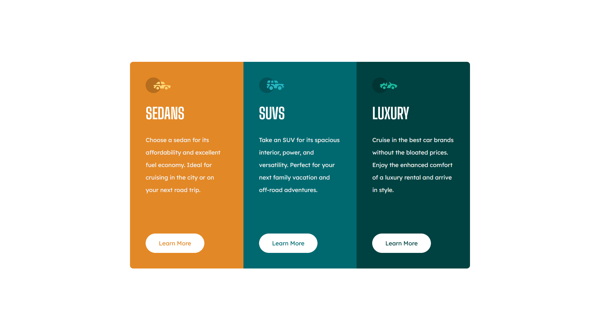

# Frontend Mentor - 3-column preview card component solution

This is a solution to the [3-column preview card component challenge on Frontend Mentor](https://www.frontendmentor.io/challenges/3column-preview-card-component-pH92eAR2-). Frontend Mentor challenges help you improve your coding skills by building realistic projects. 

## Table of contents

- [Overview](#overview)
  - [The challenge](#the-challenge)
  - [Screenshot](#screenshot)
  - [Links](#links)
- [My process](#my-process)
  - [Built with](#built-with)
  - [What I learned](#what-i-learned)
- [Author](#author)

## Overview

### The challenge

Users should be able to:

- View the optimal layout depending on their device's screen size
- See hover states for interactive elements

### Screenshot

### Links

- Solution URL: [https://3-columns-card-component.pol-thomas.com](https://3-columns-card-component.pol-thomas.com/)

## My process

I first started with HTML then CSS (I first added a "reset.css" file to work with a clean css)
### Built with

- HTML
- CSS

### What I learned

I took advantage of this challenge to strengthen and refine my basics and use modern CSS

I learned how to make buttons with transparent text that crosses the background of the button.
And to make grid columns which always remain the same height while keeping the button always at the bottom.

## Author

- Website - [https://pol-thomas.com](https://pol-thomas.com)
- Frontend Mentor - [@PolThm](https://www.frontendmentor.io/profile/PolThm)